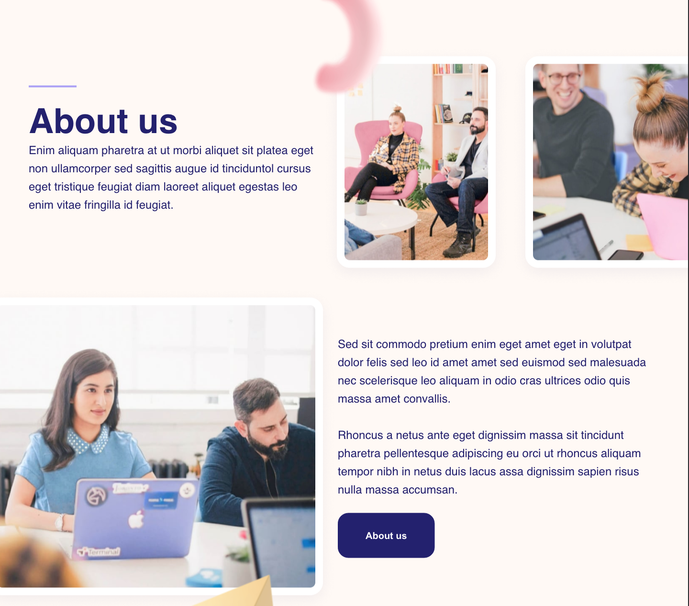

# OnePage Frontend Project

This project made for practising html, sass and JavaScript. The layout has only one page, so here it is.

 

## Small Features

* Animation of elements made on JavaScript and some JQuery.
* Styles - SASS.
* Some elements was added with help of JavaScript to make HTML-code shorter.

Project available via [this link](https://leckerbissen.github.io/desing-front/).

## Some more important information ##
* Layout - [Figma](https://www.figma.com/file/UAhjg9SdsIeVIGsZ6eCjbd/Designroom?node-id=0%3A1).
* Icons - [Iconfinder |  Hopnguyen Mr](https://www.iconfinder.com/iconsets/social-media-2146).
* Author - Linkova Iuliia. My [telegram account](https://t.me/leckerbissen).

